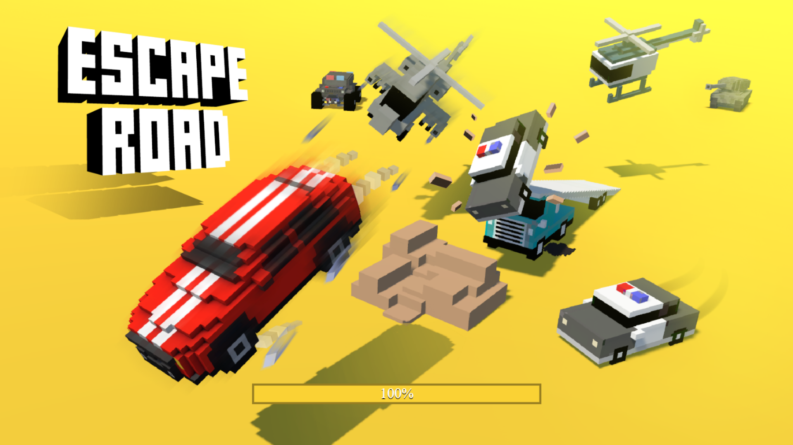

# 🚗 Escape Roads

An exciting endless runner game built with HTML5 Canvas and JavaScript. Jump over obstacles, collect power-ups, and see how far you can go!



## 🎮 Features

- **Endless Runner Gameplay**: Navigate through an endless road filled with obstacles
- **Power-Up System**: Collect various power-ups to enhance your gameplay:
  - 🟡 **Score Multiplier**: Double your points
  - 🔵 **Shield**: Protect yourself from one obstacle hit
  - 🟢 **High Jump**: Jump higher for a limited time
  - 🟣 **Slow Time**: Slow down obstacles temporarily
- **Score Tracking**: Track your current score and high score (saved locally)
- **Progressive Difficulty**: Game speed increases as you progress
- **Smooth Physics**: Realistic gravity and jumping mechanics
- **Parallax Background**: Beautiful animated background with stars

## 🎯 How to Play

1. **Jump**: Press `SPACE` to make your character jump
2. **Avoid Obstacles**: Don't hit the red obstacles!
3. **Collect Power-Ups**: Grab the colored power-ups to gain advantages
4. **Survive**: See how long you can last and beat your high score!

## 🚀 Getting Started

### Prerequisites

- A modern web browser (Chrome, Firefox, Safari, Edge)
- No additional dependencies required!

### Installation

1. Clone the repository:
```bash
git clone https://github.com/hamse122/Escape-Roads.git
cd Escape-Roads
```

2. Open `index.html` in your web browser

That's it! No build process or installation needed.


## 🎨 Game Mechanics

### Player
- Blue square character that can jump
- Gravity-based physics system
- Ground collision detection

### Obstacles
- Red squares that move from right to left
- Spawn at regular intervals
- Speed increases over time

### Power-Ups
- **Gold (Score Multiplier)**: Doubles your score for 5 seconds
- **Blue (Shield)**: Protects you from one obstacle hit
- **Green (High Jump)**: Increases jump height for 5 seconds
- **Purple (Slow Time)**: Slows down obstacles for 5 seconds

## 🛠️ Technologies Used

- **HTML5**: Structure and canvas element
- **JavaScript**: Game logic, physics, and mechanics
- **CSS**: Styling and layout
- **Canvas API**: 2D rendering and graphics

## 📝 License

This project is licensed under the MIT License - see the [LICENSE](LICENSE) file for details.

## 👤 Author

**hamse122**

- GitHub: [@hamse122](https://github.com/hamse122)

## 🤝 Contributing

Contributions, issues, and feature requests are welcome! Feel free to check the [issues page](https://github.com/hamse122/Escape-Roads/issues).

## ⭐ Acknowledgments

- Built with vanilla JavaScript - no frameworks required!
- Inspired by classic endless runner games

---

**Enjoy playing Escape Roads! 🎮**
